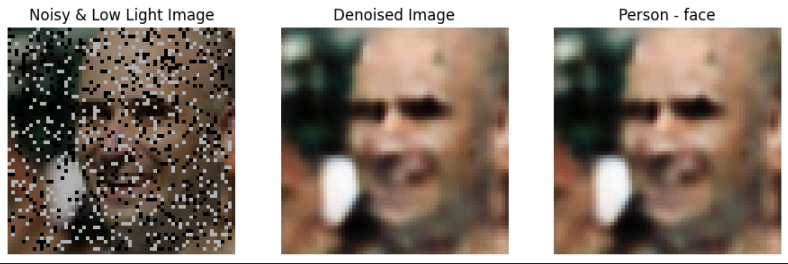

# LifeScan: Noise-Free Imaging and Body Part Recognition for Disaster Relief

##  Overview
LifeScan is a deep learning-based edge AI application designed for disaster relief. It captures noise-free images and performs body part recognition to assist in locating and identifying trapped individuals in real-time using edge devices like the Raspberry Pi.

##  Tech Stack
- Python, TensorFlow, ONNX
- Raspberry Pi (Edge Deployment)
- Matplotlib, PIL
- ONNX Runtime for fast inference

##  Features
-  Image Denoising for clearer visuals in low-quality disaster environments
-  Lightweight Body Part Recognition model
-  Optimized for low-power edge devices
-  Real-time inference and visualization

## Project Structure
- models/ # Pretrained models in ONNX format
- images/ # Overview and pipeline images
- notebooks/ # exploratory notebooks
- requirements.txt # Dependency file
- 
## 📸 Sample Results

Here's an overview of the model's performance across the pipeline:



<sub>From left to right: Original → Denoised → Body Part Recognition</sub>


## Setup Instructions

1. Clone or download the repo.
2. Install dependencies:
   ```bash
   pip install -r requirements.txt
Run the main inference script using your desired runtime:

TensorFlow Runtime:
python notebooks/tensorflow_inference.py

TFLite Runtime (optimized for edge devices):
python notebooks/tflite_inference.py

ONNX Runtime (lightweight & fast for edge deployment):
python notebooks/onnx_inference.py

## Edge Deployment (Raspberry Pi)

- Ensure ONNX runtime is installed.
- Use lightweight ONNX models in the models/ folder.
- Adjust input size and camera feed in main.py.

## License

This project is licensed under the MIT License.


